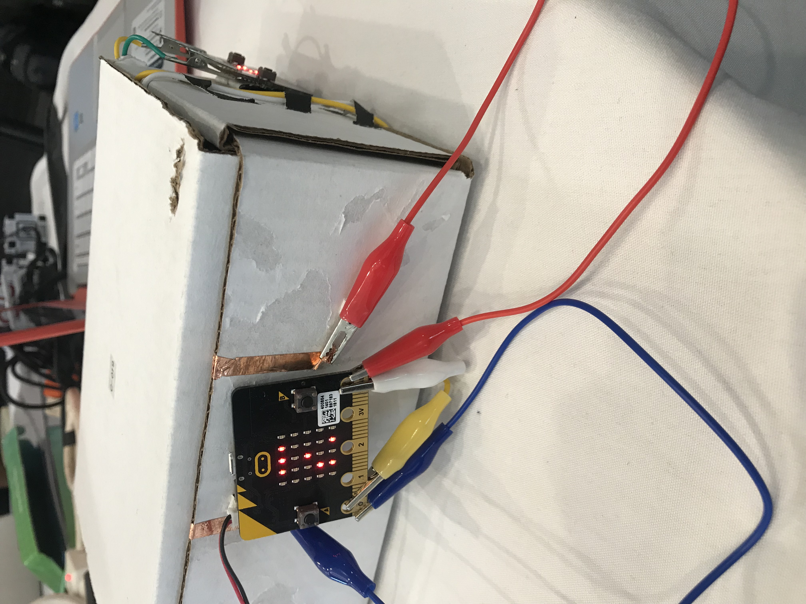

# SoarCS 2019!

<!-- Note, the line below this one is what links to your screenshot, **DO NOT REMOVE** -->

<!--
In this file, you should write a brief description of what your
project is, what you learned, and a simple screenshot of your work.

To add a screenshot, please replace `screenshot.png` with
your own screenshot.
-->

## My Lockbox Project

The projects utilizes a microbit and servo to trigger an alarm when a box is opened. The box has two microbits, buzzers, and a servo that are supposed to interact with each other when the box is opened. The microbit with the servo is programmed to move depending on which button is pressed to unlock and lock the box, while the other microbit is programmed to set of an alarm on the buzzer when the box is opened.

